# Final Project - MYGRAM

Doc Postman : https://documenter.getpostman.com/view/11331530/2s8YK9Kkdo

Cara Menjalankan

- Buat Database
- Clone Github
- Masuk ke Folder final-project
- Ubah name .env.example ke .env dan ubah isi file .env sesuai dengan database yang digunakan
- Jalankan dengan perintah di terminal
```
go run main.go
```

### Biodata
Nama            : Rizky Prayatman <br>
Kode Peserta    : 396 <br>
Asal            : Gorontalo <br>
Alasan Belajar  : Agar dapat mempelajari Pemograman Golang

1. Endpoint User - Register
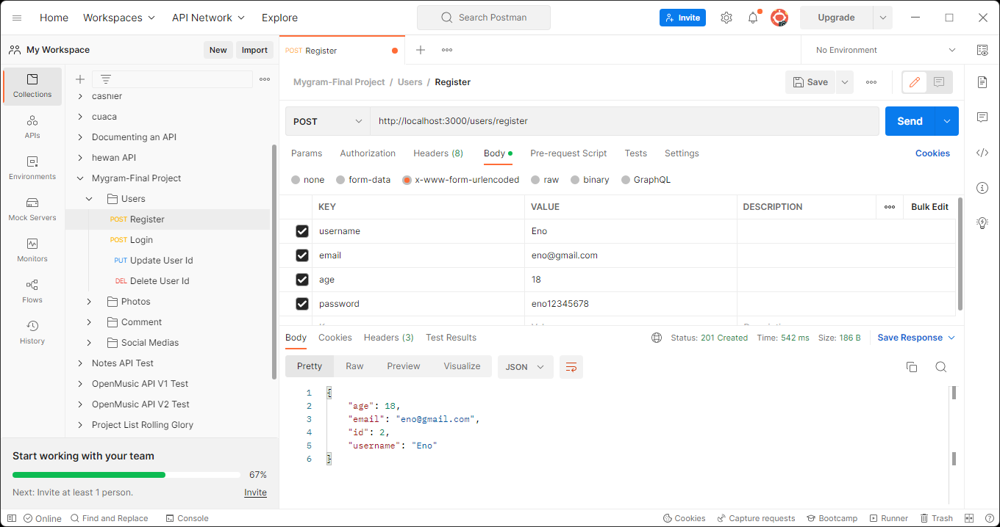
2. Endpoint User - Login
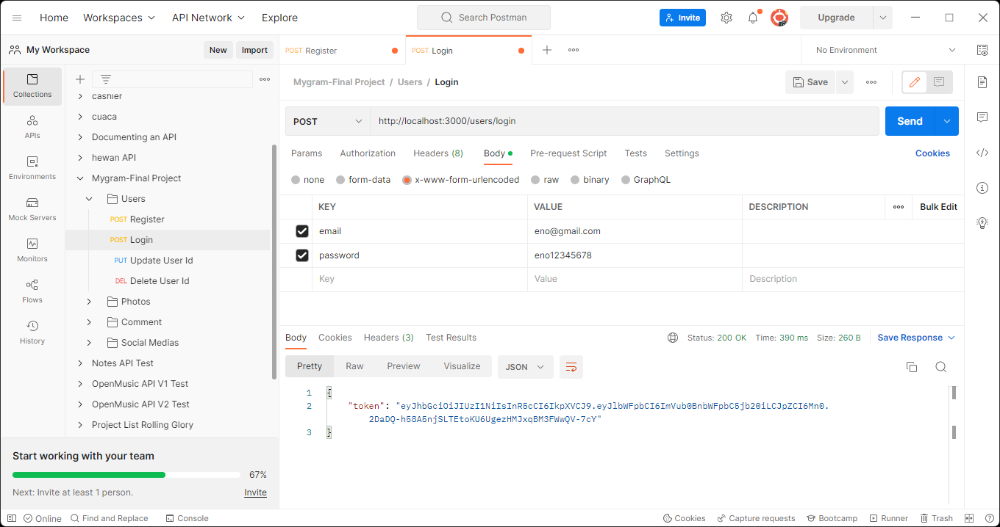
3. Endpoint User - Update User
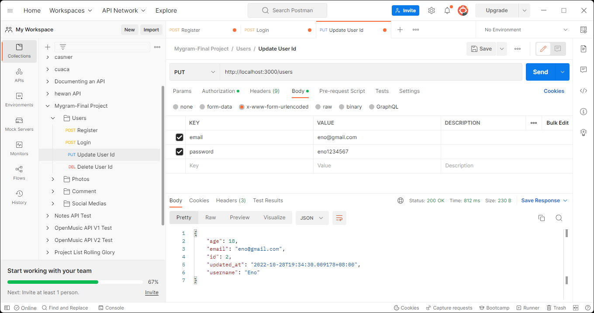
4. Endpoint User - Delete User
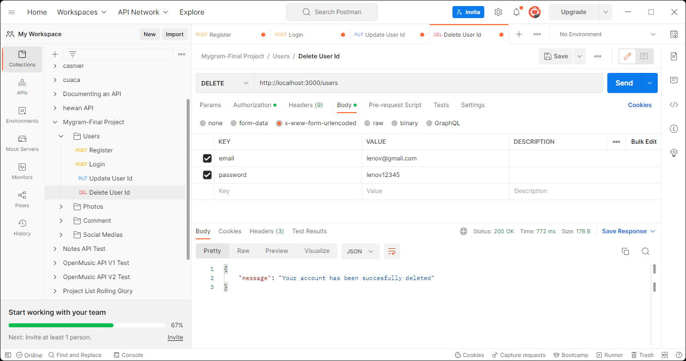 <br><br>

5. Endpoint Photo - Post Photo
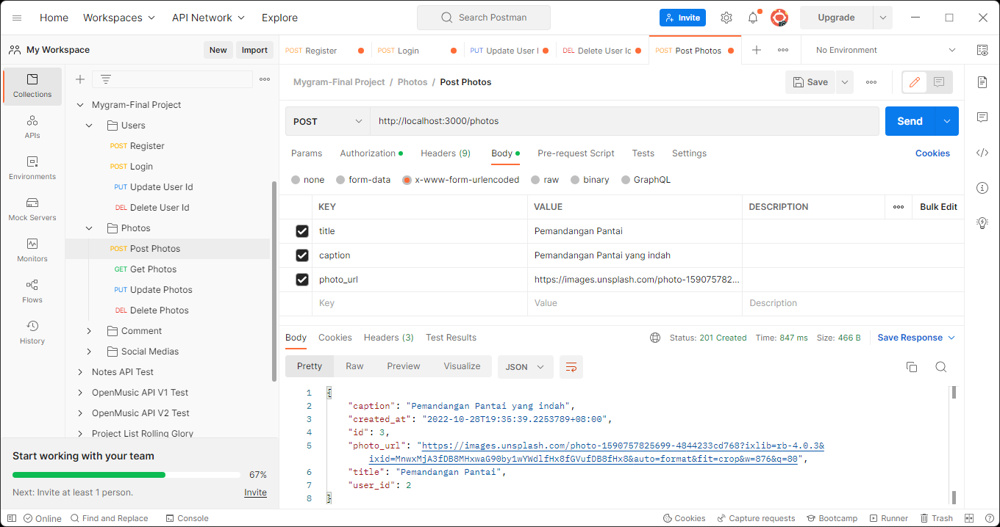
6. Endpoint Photo - Get Photos
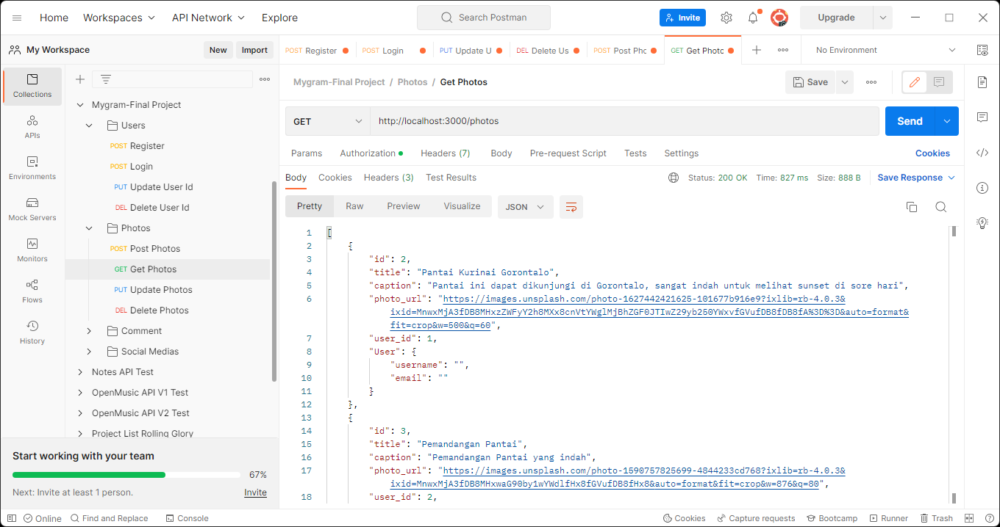
7. Endpoint Photo - Update Photo
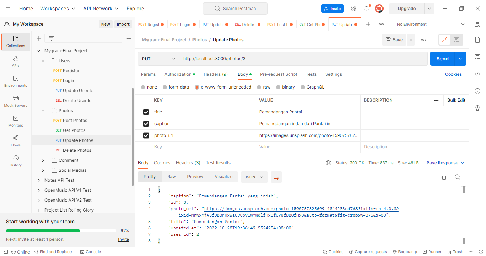
8. Endpoint Photo - Delete Photo
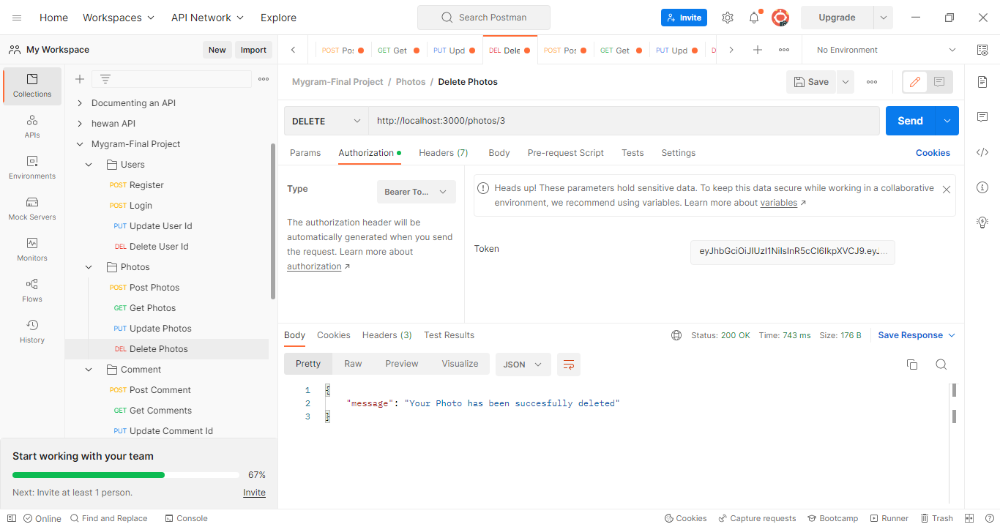

9. Endpoint Photo - Post Comment
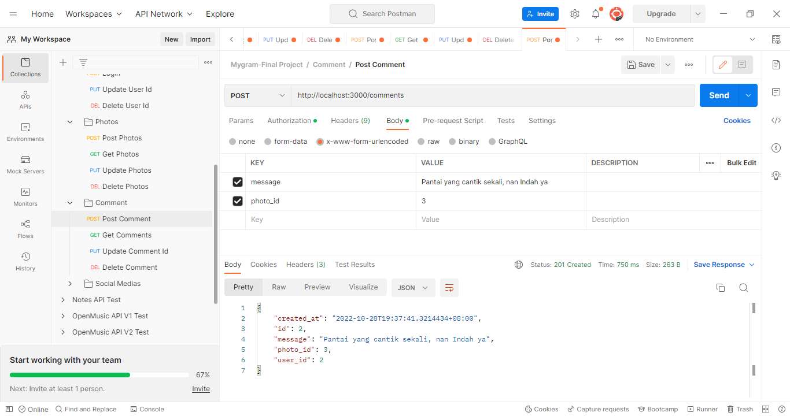
10. Endpoint Photo - Get Comments
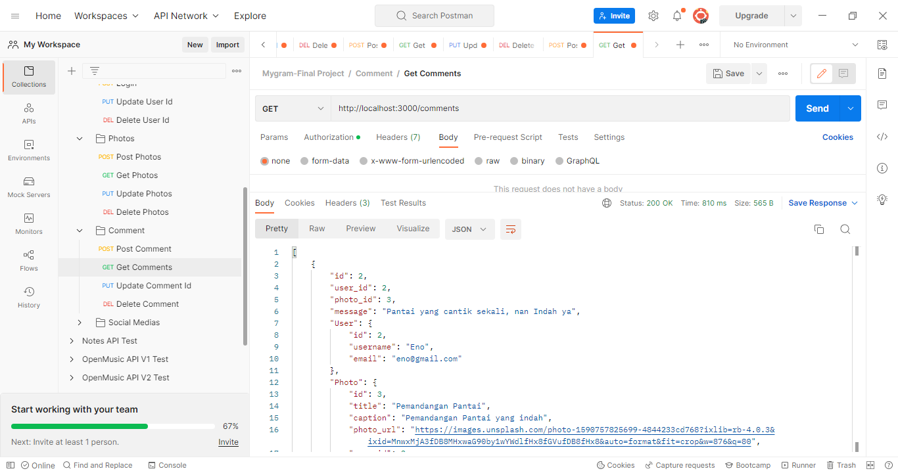
11. Endpoint Photo - Update Comment
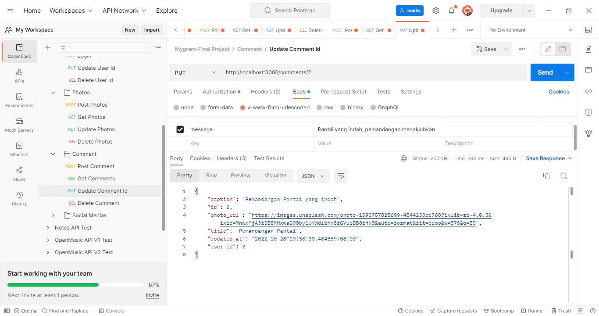
12. Endpoint Photo - Delete Comment
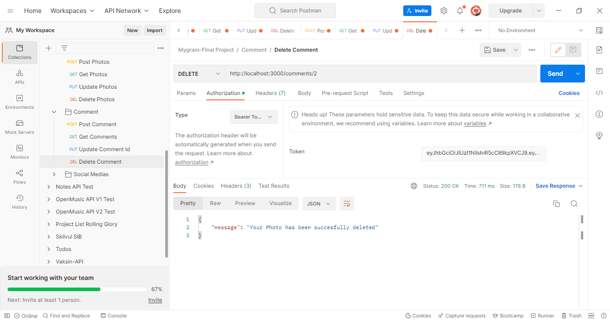

9. Endpoint Photo - Post Social Media
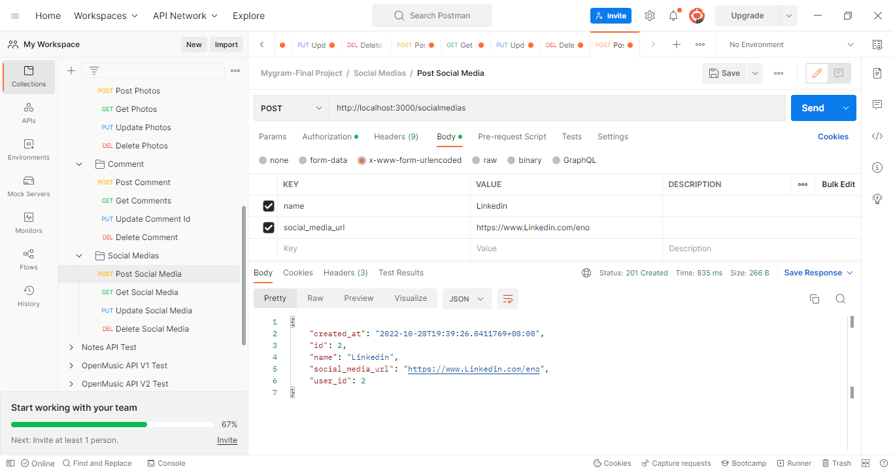
10. Endpoint Photo - Get Social Media
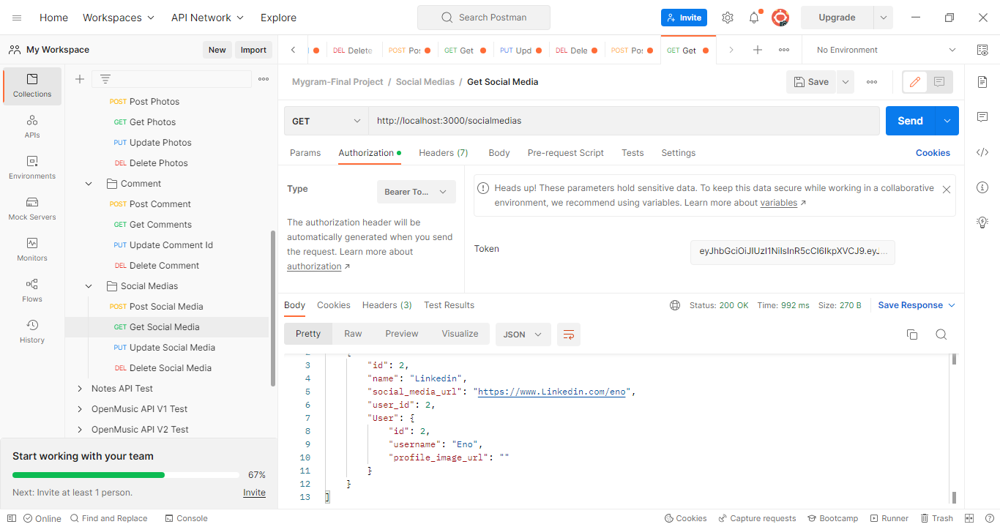
11. Endpoint Photo - Update Social Media
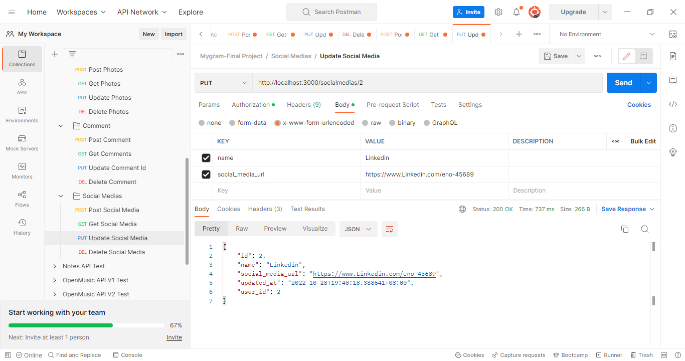
12. Endpoint Photo - Delete Social Media
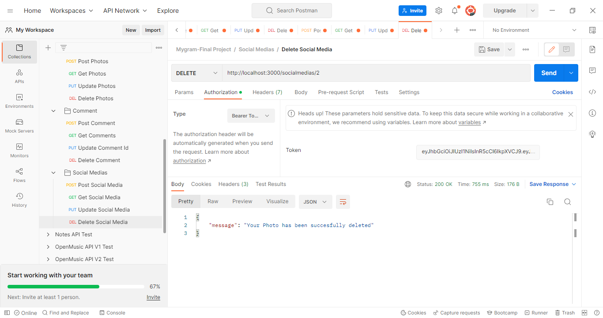

Folder Gambar Test API - Postman di Folder Postman
